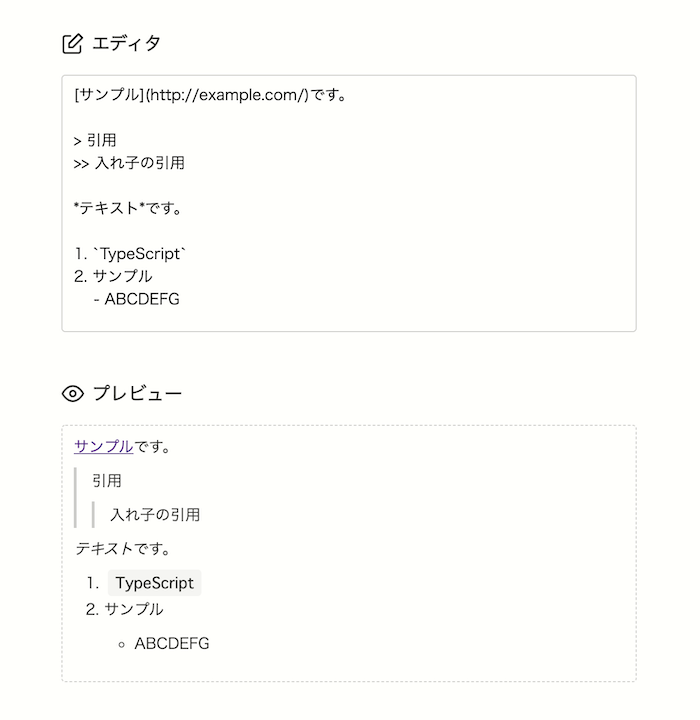

# Toy React.js Markdown Editor

React.jsで `marked` と `dompurify` を用いて、簡単なマークダウンエディタを作ってみる。


## スクリーンショット




## 前準備

```shell
yarn install
```


## 起動

```shell
yarn start
```

`http://localhost:3000/` にアクセスすると確認できます。


## カスタマイズ

利用できるタグに制限を設けていますが、変更は可能です。

`src/libs/Sanitizer.ts` で許可するタグ・属性を定義できます。
